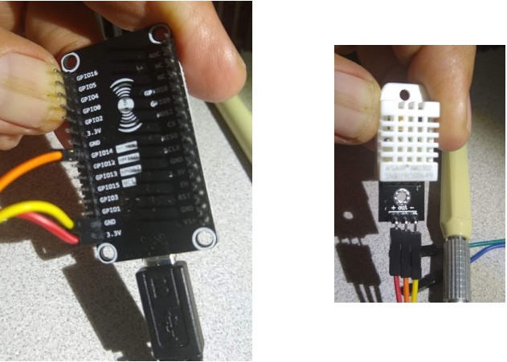

# Temperature/Humidity Sensor

## Summary

Use NodeMCU ESP8266 development board and DHT22 Temperature and Humdity Sensor to track the Temperature and Humidity inside my room and display it in a dashboard using the Losant app.

## Circuitry

__DHT22 Pin__ &emsp; __NodeMCU__

&emsp;\+ --------------- 3.3V

&emsp;Out ------------ D5 / GPIO 14

&emsp;\- --------------- Gnd

